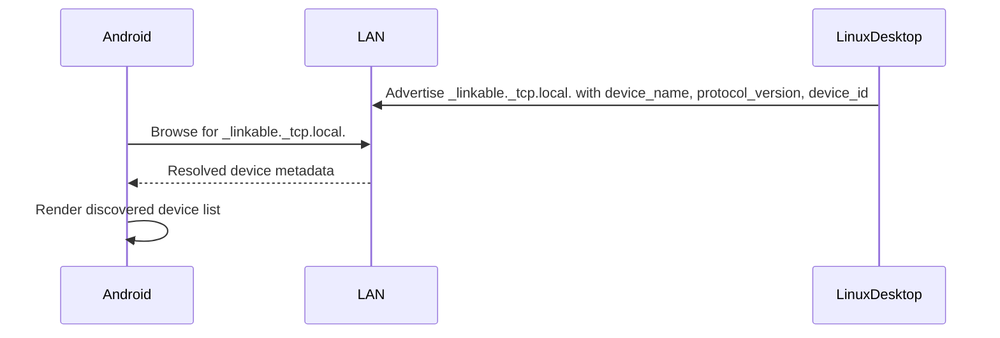
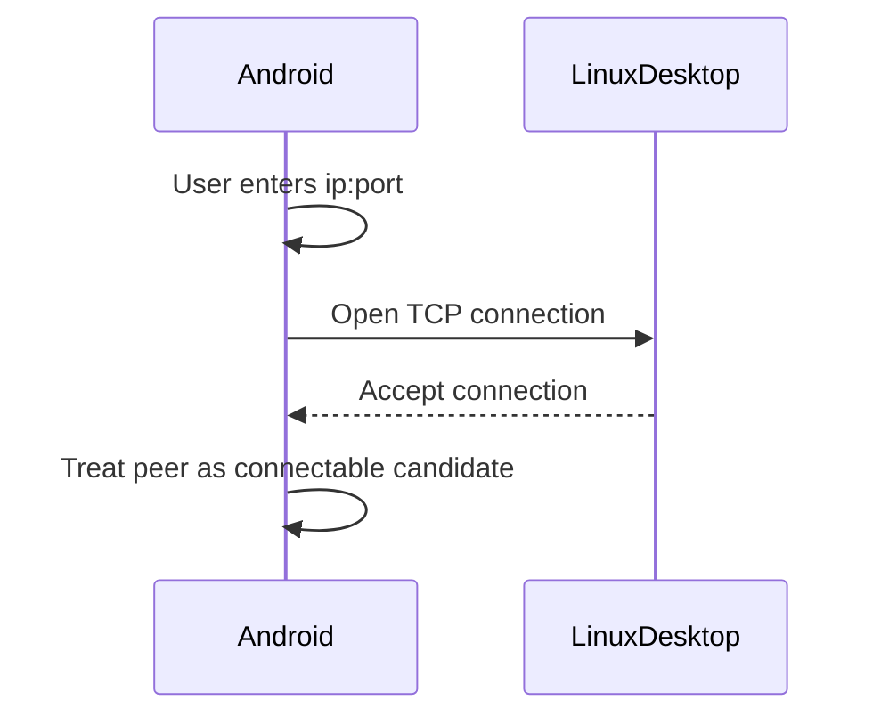
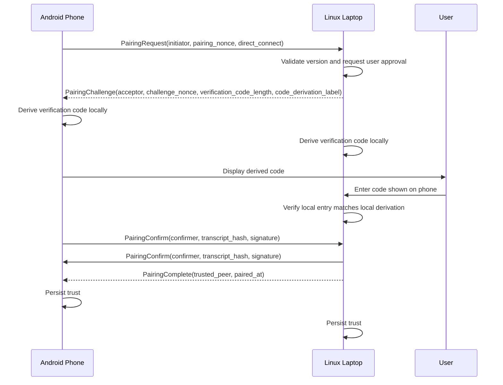
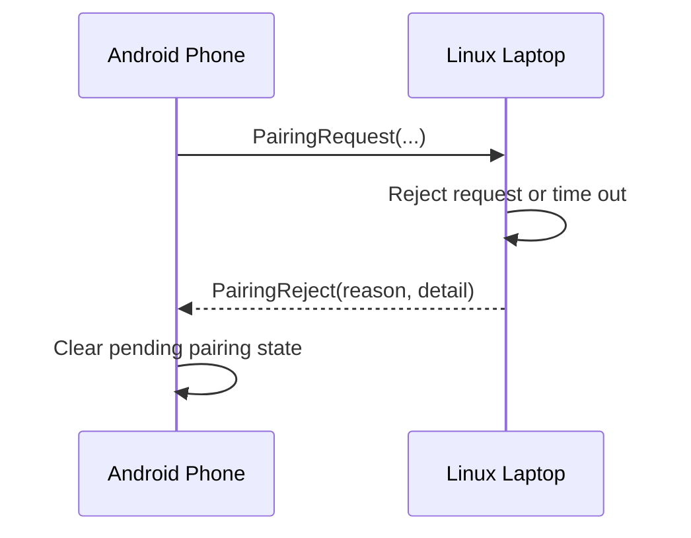
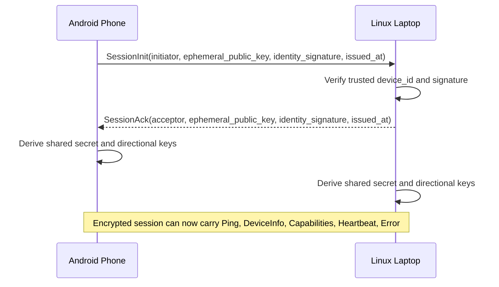
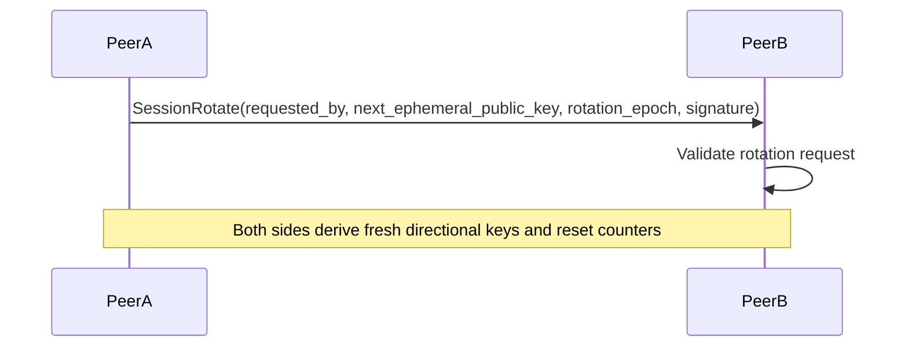
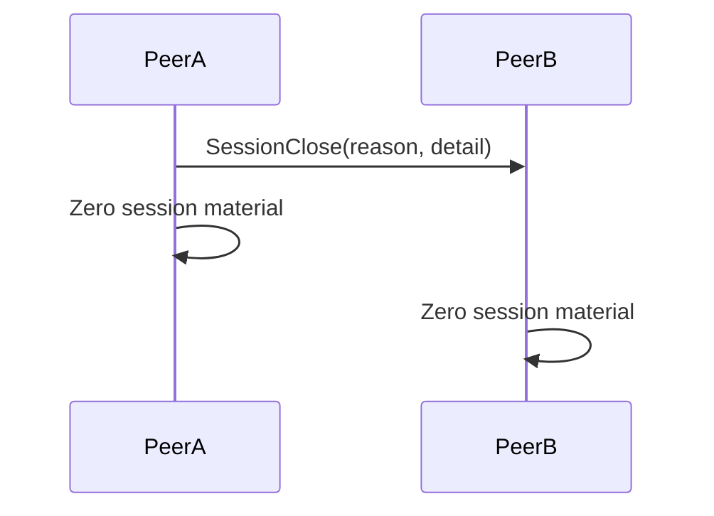

# Packet Flows

This document captures the Phase 1 / Milestone 1 flows as sequence diagrams.

## 1. Discovery Overview

## 2. Direct Connect Fallback

## 3. Pairing Success Flow

## 4. Pairing Rejection Flow

## 5. Trusted Session Establishment

## 6. Session Rotation

## 7. Session Close

