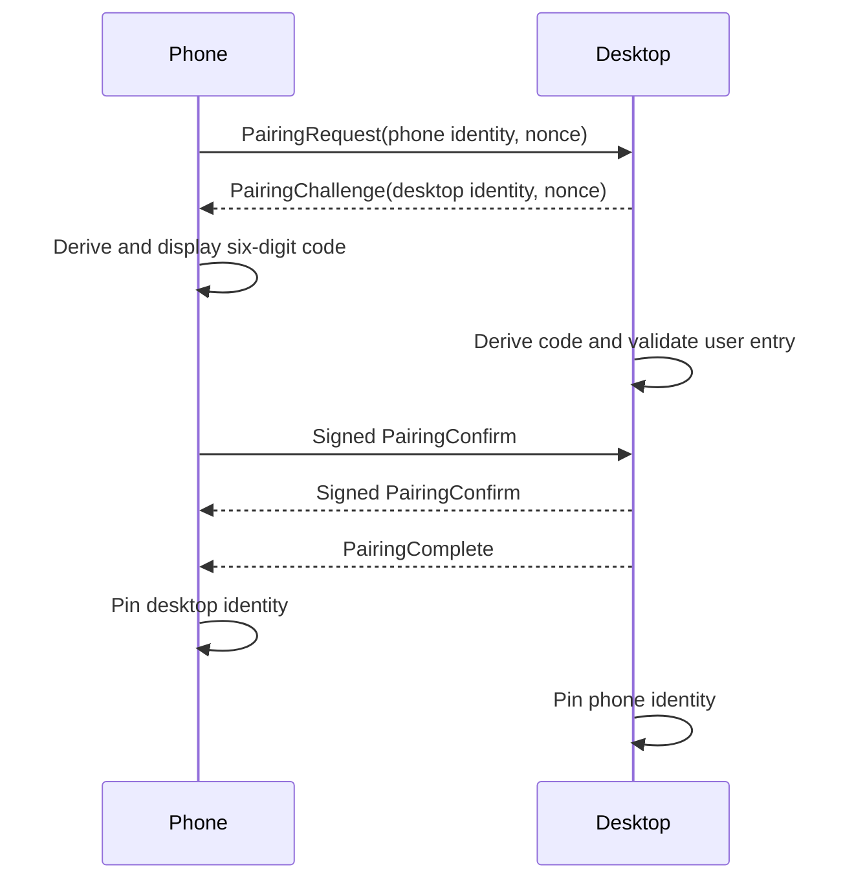
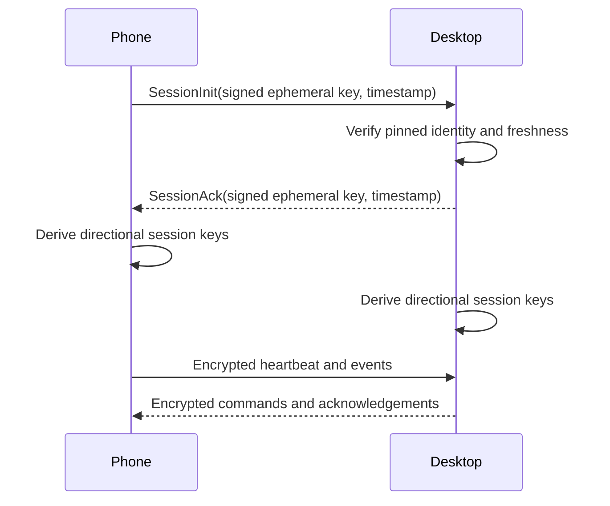
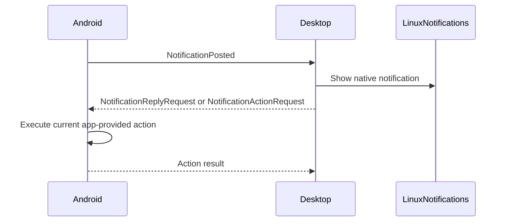
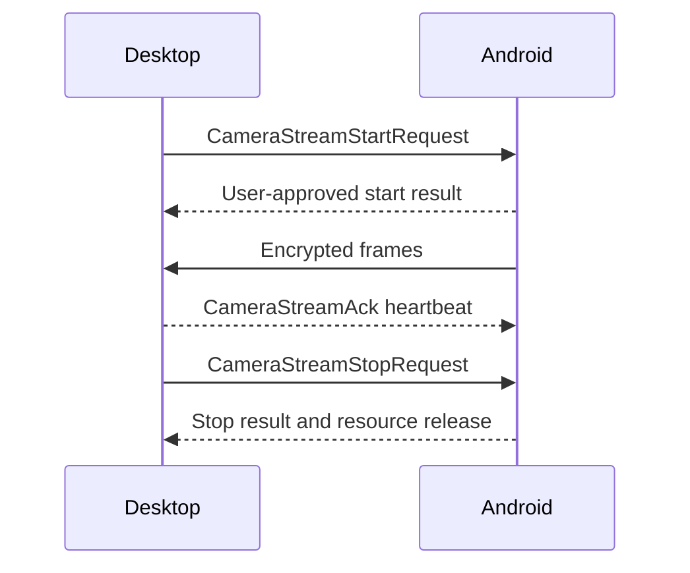

# Packet Flows

## Pairing

## Trusted Reconnect

## Notification

## Camera Session

Direct connection changes only endpoint discovery. It does not bypass pairing
or trusted-session authentication.
