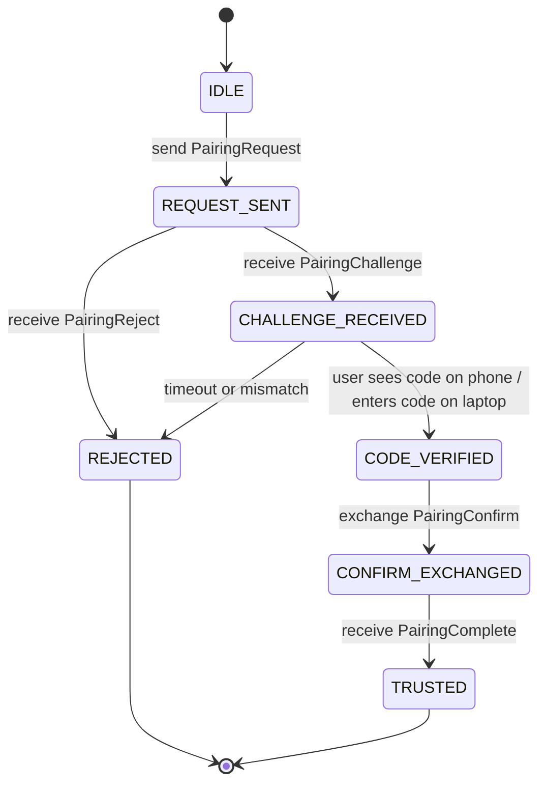
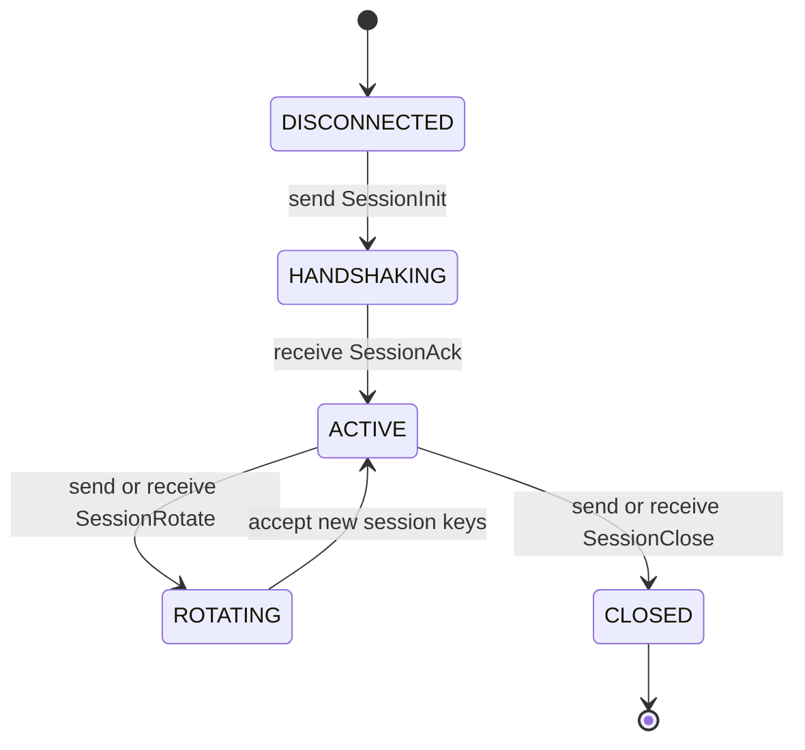

# Protocol Specification

This document defines the Milestone 1 protocol for the Linkable project.

## Scope

Milestone 1 covers:

- packet taxonomy
- frame format
- discovery metadata expectations
- secure pairing transcript
- session-establishment contract
- transport packet definitions
- timeout and error semantics

Milestone 1 does not implement discovery or transport runtime code yet. It stabilizes the contract that those later milestones will implement.

## Deliberate Deviations From The Blueprint

Two design choices intentionally differ from the blueprint because they are more robust for a protocol-first milestone:

1. Android generation targets **Java Lite protobuf outputs** rather than Kotlin-specific protobuf outputs.
   Kotlin can consume these classes later without requiring a Kotlin protobuf compiler plugin at Milestone 1 time.
2. The top-level wire `Envelope` uses a typed header and opaque `bytes payload` rather than a `oneof` of every packet type.
   This avoids cross-file import cycles, keeps transport framing stable, and lets packet families evolve independently.

## Versioning

Protocol version for Milestone 1:

- `major = 1`
- `minor = 0`
- `patch = 0`

Rules:

- A `major` mismatch is incompatible.
- A `minor` mismatch is tolerated only if the receiver understands the packet type and payload.
- `patch` is informational.

## Discovery Metadata

Discovery is out of scope for Milestone 1 runtime implementation, but later milestones are expected to advertise at least:

- `device_name`
- `protocol_version`
- `device_id`
- `service_port`

The protocol does not require discovery to succeed. A direct `ip:port` connection remains valid.

## Frame Format

Every wire message uses a length-prefixed frame:

```text
[4-byte big-endian unsigned payload length][N bytes protobuf Envelope]
```

The `Envelope` is defined in `common.proto`:

- `protocol_version`
- `packet_type`
- `sequence_number`
- `payload`

The `payload` is the serialized protobuf message associated with `packet_type`.

## Sequence Numbers

- Sequence numbers are monotonic per session direction.
- The first payload packet of a session uses sequence number `1`.
- Sequence number `0` is reserved.
- A receiver must reject duplicate or regressive sequence numbers.

## Packet Registry

| Packet Type | ID | Payload Message |
|---|---:|---|
| `PACKET_TYPE_PAIRING_REQUEST` | 1001 | `PairingRequest` |
| `PACKET_TYPE_PAIRING_CHALLENGE` | 1002 | `PairingChallenge` |
| `PACKET_TYPE_PAIRING_CONFIRM` | 1003 | `PairingConfirm` |
| `PACKET_TYPE_PAIRING_COMPLETE` | 1004 | `PairingComplete` |
| `PACKET_TYPE_PAIRING_REJECT` | 1005 | `PairingReject` |
| `PACKET_TYPE_SESSION_INIT` | 2001 | `SessionInit` |
| `PACKET_TYPE_SESSION_ACK` | 2002 | `SessionAck` |
| `PACKET_TYPE_SESSION_ROTATE` | 2003 | `SessionRotate` |
| `PACKET_TYPE_SESSION_CLOSE` | 2004 | `SessionClose` |
| `PACKET_TYPE_PING` | 3001 | `Ping` |
| `PACKET_TYPE_PONG` | 3002 | `Pong` |
| `PACKET_TYPE_DEVICE_INFO_REQUEST` | 3003 | `DeviceInfoRequest` |
| `PACKET_TYPE_DEVICE_INFO_RESPONSE` | 3004 | `DeviceInfoResponse` |
| `PACKET_TYPE_CAPABILITIES_REQUEST` | 3005 | `CapabilitiesRequest` |
| `PACKET_TYPE_CAPABILITIES_RESPONSE` | 3006 | `CapabilitiesResponse` |
| `PACKET_TYPE_HEARTBEAT` | 3007 | `Heartbeat` |
| `PACKET_TYPE_NOTIFICATION_POSTED` | 4001 | `NotificationPosted` |
| `PACKET_TYPE_NOTIFICATION_REMOVED` | 4002 | `NotificationRemoved` |
| `PACKET_TYPE_NOTIFICATION_REPLY_REQUEST` | 4003 | `NotificationReplyRequest` |
| `PACKET_TYPE_NOTIFICATION_REPLY_RESULT` | 4004 | `NotificationReplyResult` |
| `PACKET_TYPE_NOTIFICATION_ACTION_REQUEST` | 4005 | `NotificationActionRequest` |
| `PACKET_TYPE_NOTIFICATION_ACTION_RESULT` | 4006 | `NotificationActionResult` |
| `PACKET_TYPE_FILE_OFFER` | 5001 | `FileOffer` |
| `PACKET_TYPE_FILE_CHUNK` | 5002 | `FileChunk` |
| `PACKET_TYPE_FILE_COMPLETE` | 5003 | `FileComplete` |
| `PACKET_TYPE_FILE_TRANSFER_RESULT` | 5004 | `FileTransferResult` |
| `PACKET_TYPE_RING_PHONE_REQUEST` | 6001 | `RingPhoneRequest` |
| `PACKET_TYPE_RING_PHONE_RESULT` | 6002 | `RingPhoneResult` |
| `PACKET_TYPE_CALL_STATE_EVENT` | 7001 | `CallStateEvent` |
| `PACKET_TYPE_CALL_CONTROL_REQUEST` | 7002 | `CallControlRequest` |
| `PACKET_TYPE_CALL_CONTROL_RESULT` | 7003 | `CallControlResult` |
| `PACKET_TYPE_DIAL_REQUEST` | 7004 | `DialRequest` |
| `PACKET_TYPE_DIAL_RESULT` | 7005 | `DialResult` |
| `PACKET_TYPE_TELEPHONY_DIAGNOSTICS_REQUEST` | 7006 | `TelephonyDiagnosticsRequest` |
| `PACKET_TYPE_TELEPHONY_DIAGNOSTICS_RESULT` | 7007 | `TelephonyDiagnosticsResult` |
| `PACKET_TYPE_CALL_METADATA_EVENT` | 7008 | `CallMetadataEvent` |
| `PACKET_TYPE_PHONE_CAPABILITY_SNAPSHOT` | 7009 | `PhoneCapabilitySnapshot` |
| `PACKET_TYPE_BLUETOOTH_ASSIST_DESKTOP_STATUS` | 8001 | `BluetoothAssistDesktopStatus` |
| `PACKET_TYPE_BLUETOOTH_ASSIST_PHONE_STATUS` | 8002 | `BluetoothAssistPhoneStatus` |
| `PACKET_TYPE_DESKTOP_INPUT_REQUEST` | 8501 | `DesktopInputRequest` |
| `PACKET_TYPE_DESKTOP_INPUT_RESULT` | 8502 | `DesktopInputResult` |
| `PACKET_TYPE_SHARED_APPS_SNAPSHOT` | 8601 | `SharedAppsSnapshot` |
| `PACKET_TYPE_SHARED_APP_LAUNCH_REQUEST` | 8602 | `SharedAppLaunchRequest` |
| `PACKET_TYPE_SHARED_APP_LAUNCH_RESULT` | 8603 | `SharedAppLaunchResult` |
| `PACKET_TYPE_PHONE_FILE_LIST_REQUEST` | 8701 | `PhoneFileListRequest` |
| `PACKET_TYPE_PHONE_FILE_LIST_RESPONSE` | 8702 | `PhoneFileListResponse` |
| `PACKET_TYPE_PHONE_FILE_PULL_REQUEST` | 8703 | `PhoneFilePullRequest` |
| `PACKET_TYPE_PHONE_FILE_PULL_RESULT` | 8704 | `PhoneFilePullResult` |
| `PACKET_TYPE_PHONE_CONTACTS_REQUEST` | 8801 | `PhoneContactsRequest` |
| `PACKET_TYPE_PHONE_CONTACTS_RESPONSE` | 8802 | `PhoneContactsResponse` |
| `PACKET_TYPE_PHONE_RECENT_CONTACTS_REQUEST` | 8803 | `PhoneRecentContactsRequest` |
| `PACKET_TYPE_PHONE_RECENT_CONTACTS_RESPONSE` | 8804 | `PhoneRecentContactsResponse` |
| `PACKET_TYPE_ERROR` | 9001 | `ErrorPayload` |

## Identity Model

Each peer has a long-lived identity:

- `device_id`: a stable fingerprint derived from the long-lived identity public key
- `identity_public_key`: the public key used for future trust and session signature checks

Milestone 1 names the intended cryptographic model but does not bind the runtime implementation to a specific Android keystore technique yet.

Expected long-term algorithm targets:

- long-lived identity signing: Ed25519
- ephemeral session agreement: X25519
- AEAD session protection: ChaCha20-Poly1305

## Pairing Protocol

### Goal

Let one Android phone and one Linux laptop establish mutual trust on the same LAN with a user-visible short code.

### Roles

- Initiator: the side that starts pairing after discovery or direct connect
- Acceptor: the side that receives the pairing request and asks for user approval

### Pairing State Machine



### Pairing Messages

1. Initiator sends `PairingRequest`.
2. Acceptor verifies basic compatibility and, if user-approved, sends `PairingChallenge`.
3. Both sides derive the same verification code locally.
4. The phone displays the code.
5. The laptop user types that code into the laptop UI.
6. If the acceptor verifies the typed code, both sides exchange `PairingConfirm`.
7. If both signatures validate, the acceptor sends `PairingComplete`.
8. Both peers persist trust.

### Verification Code Derivation

The short-code design in the blueprint had an internal contradiction. Milestone 1 fixes it by deriving the same code on both sides instead of generating a code on one side and only sending a hash.

Inputs:

- `pairing_nonce` from `PairingRequest`
- `challenge_nonce` from `PairingChallenge`
- initiator identity public key
- acceptor identity public key
- label string from `PairingChallenge.code_derivation_label`

Reference derivation:

```text
raw = HKDF-SHA256(
  ikm  = pairing_nonce || challenge_nonce,
  salt = initiator_identity_public_key || acceptor_identity_public_key,
  info = "linkable-pair-code-v1",
  len  = 8
)

verification_code = decimal(raw mod 10^code_length)
```

Rules:

- the code is never sent on the wire
- only public transcript inputs are used
- the code exists only for user confirmation, not for cryptographic secrecy

### Pairing Confirm Transcript

Both sides sign the same transcript hash:

```text
transcript = SHA-256(
  "PAIR_CONFIRM_V1" ||
  pairing_nonce ||
  challenge_nonce ||
  initiator_device_id ||
  acceptor_device_id ||
  verification_code
)
```

`PairingConfirm.transcript_hash` contains the transcript hash.

`PairingConfirm.transcript_signature` contains the signature over that transcript hash with the sender identity key.

### Pairing Timeouts

- pairing request to challenge: 15 seconds
- challenge to local user confirmation: 120 seconds
- confirm exchange: 15 seconds

On timeout, the side detecting failure sends `PairingReject` when possible.

## Session Establishment

### Goal

Allow trusted peers to establish an encrypted transport session after pairing without repeating the short-code flow.

### Session State Machine



### Session Messages

- `SessionInit`
- `SessionAck`
- `SessionRotate`
- `SessionClose`

Session messages carry:

- peer identity
- ephemeral public key
- signature proving the sender identity authorizes that ephemeral key
- issuance time

Milestone 1 defines the fields and semantics but does not yet implement runtime session code.

### Session Key Derivation

Reference design:

```text
shared_secret = X25519(my_ephemeral_private, peer_ephemeral_public)
c2s = HKDF-SHA256(shared_secret, info="linkable-c2s-v1", len=32)
s2c = HKDF-SHA256(shared_secret, info="linkable-s2c-v1", len=32)
```

## Transport Messages

### Ping / Pong

Used to validate bidirectional reachability and measure latency.

### Device Info

`DeviceInfoRequest` and `DeviceInfoResponse` provide:

- peer identity
- OS version
- battery state if available
- screen-lock state
- network interface names

### Capabilities

`CapabilitiesRequest` and `CapabilitiesResponse` advertise support flags for future phases.

Examples:

- `lan_transport`
- `direct_connect`
- `notification_forwarding`
- `message_reply_while_locked`
- `call_control_while_locked`
- `bluetooth_optional`

### Heartbeat

Heartbeat packets maintain liveness once session transport exists.

Recommended default:

- interval: 15 seconds
- timeout: 3 missed heartbeats

### Notifications And Reply

Phase 2 notification packets are encrypted session packets only.

`NotificationPosted` carries normalized notification metadata plus action descriptors. Actions with `supports_remote_input=true` may be used for desktop-initiated replies.

`NotificationReplyRequest` carries the original `notification_id`, selected `action_id`, and reply text. Android executes the stored notification action using Android `RemoteInput` and answers with `NotificationReplyResult`.

Reply support is best effort. It only works while Android still has the notification action available and the source app exposes a remote-input action.

### File Transfer

Phase 2 file-transfer packets are encrypted session packets only.

Desktop-to-phone transfer currently uses:

- `FileOffer` for metadata, expected size, SHA-256, MIME type, and chunk size
- `FileChunk` for ordered chunk payloads
- `FileComplete` for final SHA-256 confirmation
- `FileTransferResult` for Android accept/failure/completion status

Android stores this first slice in the app-specific external Downloads directory. Public Downloads/MediaStore export, phone-to-desktop transfer, progress UI, cancellation, and resume are later Phase 2 work.

## Error Handling

All protocol-level failures use `ErrorPayload`.

Rules:

- non-fatal errors may keep the connection alive
- fatal errors must be followed by session closure or transport teardown
- every `ErrorPayload` should include the related packet type when known

## Direct Connect Fallback

The protocol treats direct connect as a transport bootstrap method only.

Security guarantees do not change:

- pairing still requires user confirmation
- the same transcript and signature checks still apply
- trust is still persisted only after `PairingComplete`

## Default Configuration

Recommended defaults for later milestones:

- service type: `_linkable._tcp.local.`
- default service port: `37891` (configurable)
- pairing code length: `6`
- pairing timeout: `120 seconds`
- heartbeat interval: `15 seconds`
- heartbeat miss limit: `3`
- session rotation: `60 minutes` or `100000 packets`, whichever happens first

## Milestone 1 Acceptance

Milestone 1 is complete when:

- every schema compiles with `protoc`
- the packet registry and docs match the schema definitions
- the threat model covers the pairing and session flows
- the lock-screen policy is written for future phases
- generation tooling produces Python and Android-consumable outputs
